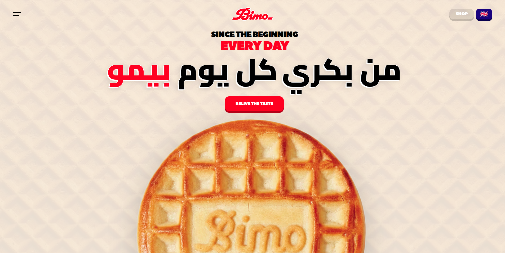

# Bimo - Bilingual Landing Page

Modern, performance-optimized landing page for BeMo, an Algerian cookie brand with 26 years of heritage. Built with Next.js , featuring smooth scroll animations and native bilingual support (English/Arabic RTL).

🔗 **Live Demo:** [bimo-redesign.vercel.app](https://bimo-redesign.vercel.app/)



---

## ✨ Features

- **Bilingual Support** - English and Arabic with full RTL layout
- **Smooth Animations** - GSAP-powered scroll effects (60fps)
- **Performance First** - <2s load time on 3G, Lighthouse 94+
- **Mobile Optimized** - Mobile-first responsive design
- **Modern Stack** - Next.js , TypeScript, Tailwind CSS

---

## 🛠️ Tech Stack

- [Next.js 16](https://nextjs.org/) - React framework
- [TypeScript](https://www.typescriptlang.org/) - Type safety
- [Tailwind CSS](https://tailwindcss.com/) - Styling
- [GSAP](https://greensock.com/gsap/) - Animations
- [Vercel](https://vercel.com/) - Deployment

---

## 🚀 Quick Start

```bash
# Clone repository
git clone https://github.com/Its-wabs/bimo-redesign.git
cd bimo

# Install dependencies
npm install

# Run development server
npm run dev

# Open http://localhost:3000
```

### Build for Production

```bash
npm run build
npm run start
```

---

## 📁 Project Structure

```
bimo/
├── app/
│   ├── [locale]/          # Internationalized routes
  ├── products/       # Products page for testing flow
   ├── page.tsx
│   │   ├── layout.tsx     # Root layout
│   │   └── page.tsx       # Home page
│   └── globals.css        # Global styles
 ├── fonts/
  ├──PeaceSans.ttf    # local custom font
├── components/
│   ├── hero.tsx           # Hero section
│   ├── Product.tsx       # Products showcase
│   ├── bimobutton.tsx    # a reusable button design
│   ├── testimonials.tsx      # Testimonials
 ├── FullScreenMenu.tsx  # Full menuscreen for navigation
 ├── LanguageSwitcher.tsx # Re-usable button for lanugage
 ├── navbar.tsx         # landing page navbar
 ├── pre-loader         # pre-loader on page reload
 ├── rollingcookie.tsx  # the main hero to video cookie
 ├── buddycookie.tsx    # rollingcookie for the rest of the page
 ├── VideoPortal.tsx    # the full video showcase after the hero
│   └── FindStore.tsx         # A final CTA + our footer
├── i18n/
│   ├── en.json            # English translations
│   └── ar.json            # Arabic translations
├── hooks/
 ├── useLiquidNavigation.ts #liquid transition animation
├── public/
│   └── img/            # Optimized images
  ├── video/      # videoportal
└── package.json
```

---

## 🌍 Languages

- 🇬🇧 English (Default)
- 🇸🇦 Arabic (Full RTL support)

Switch languages using the language selector in the navigation.

---

## ⚡ Performance

- **Lighthouse Score:** 94/100
- **First Contentful Paint:** <2s on 3G
- **Largest Contentful Paint:** <2.5s
- **Bundle Size:** ~180KB gzipped

### Optimization Techniques

- Image optimization (WebP, lazy loading)
- Code splitting for heavy components
- GPU-accelerated animations (transform/opacity only)
- Font optimization with next/font

---

## 🎨 Design Features

- Custom illustrated cookie preloader
- Scroll-triggered cookie rotation animation
- Smooth section reveals with GSAP ScrollTrigger
- Responsive grid layouts (mobile-first)
- Native RTL support for Arabic

---

## 📝 License

This project was created as a portfolio piece. All rights to the Bimo brand belong to groupe Bimo Algeria.

---

## 👤 Developer

**Cherfi Mohammed Abdelwahab**

- Portfolio: [Its-wabs](https://itswabs.vercel.app/)
- GitHub: [@Its-wabs](https://github.com/Its-wabs)
- LinkedIn: [LinkedIn](https://www.linkedin.com/in/itswabs/)

---

## 🙏 Acknowledgments

- Bimo brand for 26 years of delicious cookies
- GSAP for powerful animation library
- Next.js team for excellent framework

---

**Built with ❤️ in Algeria**
